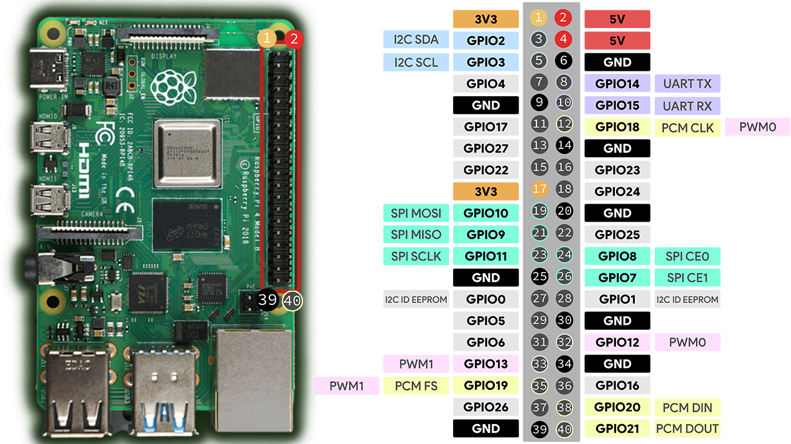

# 🧠 Raspberry Pi 4B Projects Repository



Welcome to the **Raspberry Pi 4B Projects** repository!  
This repo showcases a collection of projects built using the Raspberry Pi 4 Model B.  
From IoT experiments to retro gaming setups, and prototyping.

---

## 📁 Repository Structure

```
/
├── README.md          # Overview of the repo
├── Projects/          # Individual project folders (code, schematics, docs)
├── Files/             # Shared assets (images, configs, setup scripts)
```

---

## 🍓 About the Raspberry Pi 4B

The Raspberry Pi 4 Model B is a powerful and versatile single-board computer. It brings PC-level performance to embedded and hobbyist projects.

### 🔧 Key Features

- **CPU**: Quad-core Cortex-A72 (ARM v8) 64-bit @ 1.5GHz  
- **RAM Options**: 2GB, 4GB, or 8GB LPDDR4  
- **Connectivity**:  
  - 2× USB 3.0 and 2× USB 2.0  
  - Gigabit Ethernet  
  - Dual-band 802.11ac Wi-Fi  
  - Bluetooth 5.0  
- **Display**: Dual micro-HDMI outputs (supports up to 4K)  
- **Storage**: microSD slot + USB boot support  
- **GPIO**: 40-pin header (compatible with HATs and accessories)  
- **Power**: 5V 3A USB-C power input

---

## 🌱 Example Project Ideas

- 🕹️ RetroPie Arcade Console  
- 🌦️ IoT Weather Station with Sensors  
- 📷 Security Camera with Motion Detection  
- 📡 Local Web Dashboard with Flask  
- 🤖 GPIO Robot Arm Controller  
- 📊 Sensor Logger & Data Visualizer

---

## 🔧 Recommended Hardware

- Raspberry Pi 4B (2GB, 4GB, or 8GB)
- Official Pi Power Supply (5V 3A)
- Class 10 microSD Card (16GB+)
- Heatsinks or Fan (optional but recommended)
- Breadboard, jumper wires, basic sensors (for electronics projects)
- Monitor, keyboard, mouse (for desktop setup)

---
